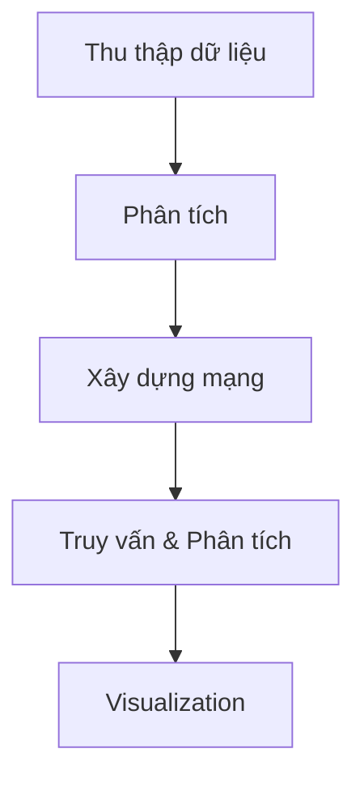

# 🎵 Music Network Graph - Phân Tích Mạng Lưới Nghệ Sĩ Âm Nhạc US-UK

[](https://www.python.org/)
[](https://networkx.org/)
[](LICENSE)

*Dự án phân tích mạng lưới quan hệ giữa các nghệ sĩ nhạc pop/rock Mỹ-Anh sử dụng dữ liệu từ Wikipedia*

[📖 Đọc tài liệu đầy đủ](./README_VIETNAMESE.md) | [🚀 Demo nhanh](#-bắt-đầu-nhanh) | [📊 Kết quả](#-kết-quả-cuối-cùng)

---

## 📋 Mục lục

- [🎯 Tổng quan](#-tổng-quan)
- [✨ Tính năng](#-tính-năng)
- [🚀 Bắt đầu nhanh](#-bắt-đầu-nhanh)
- [📦 Cài đặt](#-cài-đặt)
- [🎮 Sử dụng](#-sử-dụng)
- [🔧 Cấu hình nâng cao](#-cấu-hình-nâng-cao)
- [📊 Kết quả cuối cùng](#-kết-quả-cuối-cùng)
- [🎨 Ví dụ sử dụng](#-ví-dụ-sử-dụng)
- [🔍 Phân tích dữ liệu](#-phân-tích-dữ-liệu)
- [📈 Visualization](#-visualization)
- [🤝 Đóng góp](#-đóng-góp)
- [📝 Giấy phép](#-giấy-phép)

---

## 🎯 Tổng quan

**Music Network Graph** là một dự án nghiên cứu sử dụng trí tuệ nhân tạo và phân tích mạng để khám phá mối quan hệ phức tạp giữa các nghệ sĩ nhạc pop/rock Mỹ và Anh.

### 🌟 Điểm đặc biệt

- **🔍 Phân tích tự động**: Sử dụng AI để phân tích dữ liệu Wikipedia
- **🌐 Mạng lưới phức tạp**: Xây dựng mạng quan hệ đa chiều
- **📊 Thống kê chi tiết**: Cung cấp số liệu phân tích chuyên sâu
- **🎨 Visualization**: Hỗ trợ trực quan hóa mạng lưới

### 📈 Quy mô dự án

| Chỉ số | Giá trị | Mô tả |
|--------|---------|-------|
| 🎤 Nghệ sĩ | 167 | Solo artists, bands, groups |
| 🎼 Thể loại | 68 | Musical genres |
| 🏢 Hãng thu | 80 | Record labels |
| 🔗 Quan hệ | 458 | Collaborations, influences |
| 📄 Dữ liệu | 341KB | JSON structured data |

---

## ✨ Tính năng

### 🔍 Thu thập dữ liệu
- [x] **Wikipedia Crawling**: Tự động tải trang nghệ sĩ
- [x] **HTML Parsing**: Phân tích cấu trúc trang
- [x] **Data Extraction**: Trích xuất thông tin nghệ sĩ

### 🧠 Phân tích trí tuệ nhân tạo
- [x] **Link Discovery**: Phát hiện mối quan hệ
- [x] **Text Mining**: Khai thác thông tin từ bài viết
- [x] **Entity Recognition**: Nhận diện thực thể

### 🌐 Xây dựng mạng lưới
- [x] **Node Creation**: Tạo các nút mạng (nghệ sĩ, thể loại, hãng thu)
- [x] **Edge Detection**: Phát hiện và phân loại quan hệ
- [x] **NetworkX Integration**: Sử dụng thư viện NetworkX

### 📊 Phân tích nâng cao
- [x] **Adjacency List**: Danh sách kề cho truy vấn
- [x] **Edge Selection**: Lựa chọn quan hệ theo tiêu chí
- [x] **Edge Ranges**: Phân tích khoảng quan hệ

### 🎨 Quan hệ mở rộng
- [x] **member_of**: Thành viên ban nhạc
- [x] **produced_by**: Quan hệ với producer
- [x] **won_award**: Giành giải thưởng
- [x] **charted_on**: Lọt bảng xếp hạng
- [x] **nominated_for**: Đề cử giải thưởng

---

## 🚀 Bắt đầu nhanh

### ⚡ 5 phút để chạy demo

```bash
# 1. Clone repository
git clone https://github.com/your-username/music-network-graph.git
cd music-network-graph

# 2. Cài đặt dependencies
pip install -r requirements.txt

# 3. Chạy demo
python src/network_queries.py

# 4. Xem kết quả
python demo_adjacency_edges.py
```

### 🎯 Kết quả mong đợi

```
=== MUSIC NETWORK QUERY SYSTEM DEMO ===

1. NETWORK SUMMARY:
  Nodes: 315
  Edges: 458
  Density: 0.0093
  Components: 2

2. MOST CONNECTED ARTISTS:
  1. Arctic Monkeys (35 connections)
  2. Tame Impala (33 connections)
  3. Arcade Fire (29 connections)
```

---

## 📦 Cài đặt

### 🔧 Yêu cầu hệ thống

| Component | Version | Required |
|-----------|---------|----------|
| Python | 3.8+ | ✅ Required |
| NetworkX | 3.2+ | ✅ Required |
| BeautifulSoup4 | 4.12+ | ✅ Required |
| Requests | 2.31+ | ✅ Required |
| Matplotlib | 3.8+ | 📊 Optional |

### 🛠️ Cài đặt từ source

```bash
# Clone repository
git clone https://github.com/your-username/music-network-graph.git
cd music-network-graph

# Tạo virtual environment (khuyến nghị)
python -m venv venv
source venv/bin/activate  # Linux/Mac
# hoặc
venv\Scripts\activate     # Windows

# Cài đặt dependencies
pip install -r requirements.txt

# Verify installation
python -c "import networkx as nx; print(f'NetworkX {nx.__version__} installed')"
```

### 🐳 Cài đặt với Docker

```bash
# Build image
docker build -t music-network-graph .

# Run container
docker run -it music-network-graph

# Mount volume cho data
docker run -v $(pwd)/data:/app/data -it music-network-graph
```

---

## 🎮 Sử dụng

### 📋 Workflow cơ bản



### 🏃‍♂️ Chạy từng bước

#### 1. Thu thập dữ liệu mẫu

```bash
# Tải dữ liệu nghệ sĩ phổ biến
python src/batch_download.py

# Chọn option 1: "Download starter pack (16 diverse artists)"
# Kết quả: 16 nghệ sĩ được tải về data/raw_html/
```

#### 2. Phân tích dữ liệu

```bash
# Phân tích HTML và trích xuất thông tin
python src/wikipedia_analyzer.py

# Kết quả: analysis_results.json với thông tin nghệ sĩ
```

#### 3. Xây dựng mạng lưới

```bash
# Tạo mạng từ dữ liệu đã phân tích
python src/network_builder.py

# Kết quả: music_network.gexf và music_network_network.json
```

#### 4. Khám phá mạng

```bash
# Chạy demo hệ thống truy vấn
python src/network_queries.py

# Xem các loại cạnh mới
python demo_adjacency_edges.py
```

### 🎯 Sử dụng trong code Python

```python
from src.network_queries import MusicNetworkQuerySystem

# Khởi tạo hệ thống
query_system = MusicNetworkQuerySystem(
    network_file='data/processed/music_network.gexf',
    json_file='data/processed/music_network_network.json'
)

# Lấy thông tin nghệ sĩ
beatles_info = query_system.get_artist_info("The Beatles")
print(f"The Beatles có {beatles_info['total_connections']} kết nối")

# Tìm đường đi ngắn nhất
path = query_system.find_shortest_path("The Beatles", "Taylor Swift")
print(f"Đường đi: {path['path_length']} bước")

# Danh sách cạnh kề
adj_list = query_system.get_adjacency_list("Coldplay", include_edge_data=True)
print(f"Coldplay có {adj_list['degree']} kết nối")
```

---

## 🔧 Cấu hình nâng cao

### ⚙️ Tùy chỉnh crawler

```python
from wikipedia_crawler import WikipediaCrawler, CrawlerConfig

# Cấu hình nâng cao
config = CrawlerConfig(
    min_delay=1.0,      # Delay tối thiểu giữa requests
    max_delay=3.0,      # Delay tối đa
    save_html=True,     # Lưu HTML
    save_api_data=True, # Lưu dữ liệu API
    timeout=30,         # Timeout cho mỗi request
    max_retries=3       # Số lần thử lại
)

crawler = WikipediaCrawler(config)
```

### 🎛️ Mở rộng mạng

```bash
# Mở rộng mạng với thuật toán BFS
python src/network_expansion.py \
    --algorithm bfs \
    --max-artists 100 \
    --max-depth 3 \
    --branching-factor 4

# Sử dụng DFS
python src/network_expansion.py \
    --algorithm dfs \
    --max-artists 50 \
    --exploration-ratio 0.7
```

### 📊 Query nâng cao

```python
# Lựa chọn cạnh theo tiêu chí
collab_edges = query_system.select_edges({
    'edge_type': 'collaborates_with',
    'min_weight': 1.0
}, limit=10)

# Phân tích khoảng trọng số
weight_ranges = query_system.create_edge_ranges({
    'by': 'weight',
    'bins': 5
})

# Nhóm theo loại cạnh
edge_groups = query_system.create_edge_ranges({
    'by': 'edge_type'
})
```

---

## 📊 Kết quả cuối cùng

### 📁 Files chính

```
data/processed/
├── final_music_network_results.json    # 🎯 Kết quả tổng hợp (341KB)
├── music_network.gexf                  # 📊 Định dạng Gephi
├── music_network_network.json          # 🔧 Dữ liệu thô NetworkX
├── analysis_results.json               # 📝 Kết quả phân tích
└── crawl_session_*.json               # 📋 Lịch sử crawl
```

### 📈 Thống kê chi tiết

| Loại | Số lượng | Top 3 |
|------|----------|-------|
| 🎤 Nghệ sĩ | 167 | Arctic Monkeys, Tame Impala, Arcade Fire |
| 🎼 Thể loại | 68 | Alternative rock, Pop rock, Post-Britpop |
| 🏢 Hãng thu | 80 | Parlophone, Capitol, Domino |
| 🔗 Hợp tác | 232 | Coldplay ↔ Seal, Keane ↔ Naul |
| 📊 Thể loại | 109 | Coldplay → Alternative rock |
| 🎵 Hãng thu | 117 | The Beatles → Parlophone |

### ✅ Validation

```bash
# Kiểm tra tính hợp lệ của dữ liệu
python validate_final_results.py

# Kết quả: ✅ FILE VALIDATION PASSED
```

---

## 🎨 Ví dụ sử dụng

### 🔍 Khám phá nghệ sĩ

```python
# Nghệ sĩ có nhiều kết nối nhất
top_artists = query_system.get_most_connected_artists(5)
for artist in top_artists:
    print(f"{artist['name']}: {artist['total_connections']} kết nối")

# Kết quả:
# Arctic Monkeys: 35 kết nối
# Tame Impala: 33 kết nối
# Arcade Fire: 29 kết nối
```

### 🔗 Phân tích quan hệ

```python
# Quan hệ hợp tác của Coldplay
coldplay_info = query_system.get_artist_info("Coldplay")
print(f"Coldplay hợp tác với {len(coldplay_info['connections']['collaborators'])} nghệ sĩ")

# Tìm nghệ sĩ chung
common = query_system.find_common_collaborators("The Beatles", "Coldplay")
print(f"Nghệ sĩ hợp tác với cả hai: {len(common)}")
```

### 📊 Phân tích thể loại

```python
# Nghệ sĩ theo thể loại
rock_artists = query_system.get_artists_by_genre("Rock")
pop_artists = query_system.get_artists_by_genre("Pop")

print(f"Rock: {len(rock_artists)} nghệ sĩ")
print(f"Pop: {len(pop_artists)} nghệ sĩ")
```

---

## 🔍 Phân tích dữ liệu

### 📈 Metrics mạng

```python
# Thống kê tổng quan
summary = query_system.get_network_summary()

print(f"Mật độ mạng: {summary['basic_stats']['density']:.4f}")
print(f"Số thành phần liên thông: {summary['basic_stats']['connected_components']}")
print(f"Độ dài đường đi trung bình: {summary['basic_stats'].get('average_path_length', 'N/A')}")
```

### 🎯 Centrality Analysis

```python
import networkx as nx

# Load network
G = nx.read_gexf('data/processed/music_network.gexf')

# Tính degree centrality
degree_cent = nx.degree_centrality(G)
top_degree = sorted(degree_cent.items(), key=lambda x: x[1], reverse=True)[:5]

print("Top 5 nghệ sĩ theo degree centrality:")
for artist, score in top_degree:
    print(".4f")
```

### 🌐 Community Detection

```python
from networkx.algorithms import community

# Phát hiện cộng đồng
communities = community.greedy_modularity_communities(G)

print(f"Tìm thấy {len(communities)} cộng đồng")
for i, comm in enumerate(communities[:3]):
    print(f"Cộng đồng {i+1}: {len(comm)} nghệ sĩ")
```

---

## 📈 Visualization

### 🎨 Sử dụng Gephi

```bash
# Mở file GEXF trong Gephi
# File: data/processed/music_network.gexf

# Các bước:
# 1. Import file GEXF
# 2. Chạy layout (Force Atlas 2)
# 3. Size nodes theo degree
# 4. Color theo community/modularity
# 5. Export SVG/PDF
```

### 🌐 Web visualization với D3.js

```html
<!DOCTYPE html>
<html>
<head>
    <script src="https://d3js.org/d3.v7.min.js"></script>
</head>
<body>
    <div id="network"></div>
    <script>
        // Load JSON data
        d3.json("data/processed/music_network_network.json").then(function(data) {
            // Create force-directed layout
            const simulation = d3.forceSimulation(data.nodes)
                .force("link", d3.forceLink(data.edges).id(d => d.id))
                .force("charge", d3.forceManyBody())
                .force("center", d3.forceCenter(width / 2, height / 2));

            // Render network...
        });
    </script>
</body>
</html>
```

### 📊 Python plotting

```python
import matplotlib.pyplot as plt
import networkx as nx

# Load và vẽ mạng nhỏ
G = nx.read_gexf('data/processed/music_network.gexf')

# Lấy subgraph của 50 nodes hàng đầu
degrees = dict(G.degree())
top_nodes = sorted(degrees, key=degrees.get, reverse=True)[:50]
subgraph = G.subgraph(top_nodes)

# Vẽ
plt.figure(figsize=(12, 8))
pos = nx.spring_layout(subgraph, k=0.3)
nx.draw(subgraph, pos, with_labels=True, font_size=8, node_size=300)
plt.title("Music Network - Top 50 Artists")
plt.show()
```

---

## 🤝 Đóng góp

### 🚀 Cách đóng góp

Chúng tôi hoan nghênh mọi đóng góp! Hãy làm theo quy trình sau:

1. **Fork** repository
2. **Clone** về máy: `git clone https://github.com/your-username/music-network-graph.git`
3. **Tạo branch** mới: `git checkout -b feature/your-feature`
4. **Code** và **test**
5. **Commit**: `git commit -m "Add your feature"`
6. **Push**: `git push origin feature/your-feature`
7. **Pull Request** với mô tả chi tiết

### 🐛 Báo lỗi

Tìm thấy lỗi? Hãy [tạo issue](https://github.com/your-username/music-network-graph/issues) với:

- Mô tả chi tiết lỗi
- Steps để reproduce
- Environment (OS, Python version)
- Screenshots nếu có

### 💡 Đề xuất tính năng

Có ý tưởng mới? [Tạo issue](https://github.com/your-username/music-network-graph/issues) với label `enhancement`:

- Mô tả tính năng
- Lý do tại sao nó hữu ích
- Cách implement (nếu có)

### 📝 Quy tắc code

- **PEP 8** style guide
- **Type hints** cho function parameters
- **Docstrings** cho tất cả functions
- **Unit tests** cho logic phức tạp
- **Comments** cho code không rõ ràng

---

## 📝 Giấy phép

```
Educational License - Version 1.0

This project is for educational and research purposes only.
Wikipedia data is used under fair use for academic analysis.

Copyright (c) 2025 Music Network Graph Project

Permission is granted to use, copy, modify, and distribute this software
for educational purposes only, provided that this copyright notice
appears in all copies.
```

### ⚖️ Điều khoản sử dụng

- **Educational Use**: Chỉ sử dụng cho mục đích giáo dục và nghiên cứu
- **Wikipedia Data**: Tuân thủ fair use policy của Wikipedia
- **No Commercial Use**: Không sử dụng cho mục đích thương mại
- **Attribution**: Ghi rõ nguồn khi sử dụng

---

## 🙏 Lời cảm ơn

### 👥 Contributors

- **Project Lead**: [Your Name]
- **Contributors**: [List of contributors]

### 📚 Acknowledgments

- **Wikipedia Contributors**: Cung cấp dữ liệu phong phú
- **NetworkX Team**: Thư viện mạng tuyệt vời
- **Python Community**: Hỗ trợ kỹ thuật
- **Academic Advisors**: Hướng dẫn nghiên cứu

### 🔗 Links hữu ích

- [NetworkX Documentation](https://networkx.org/documentation/stable/)
- [Wikipedia API](https://www.mediawiki.org/wiki/API:Main_page)
- [Beautiful Soup](https://www.crummy.com/software/BeautifulSoup/)
- [Gephi Visualization](https://gephi.org/)

---

## 📞 Liên hệ

**Music Network Graph Project**

- 📧 Email: music.network.graph@example.com
- 🐙 GitHub: [https://github.com/your-username/music-network-graph](https://github.com/your-username/music-network-graph)
- 📱 Issues: [GitHub Issues](https://github.com/your-username/music-network-graph/issues)

---

*🎵 Khám phá thế giới âm nhạc qua mạng lưới quan hệ! 🎶*

---

*Generated on: 2025-10-17*
*Version: 2.0 - Vietnamese Repository Guide*
